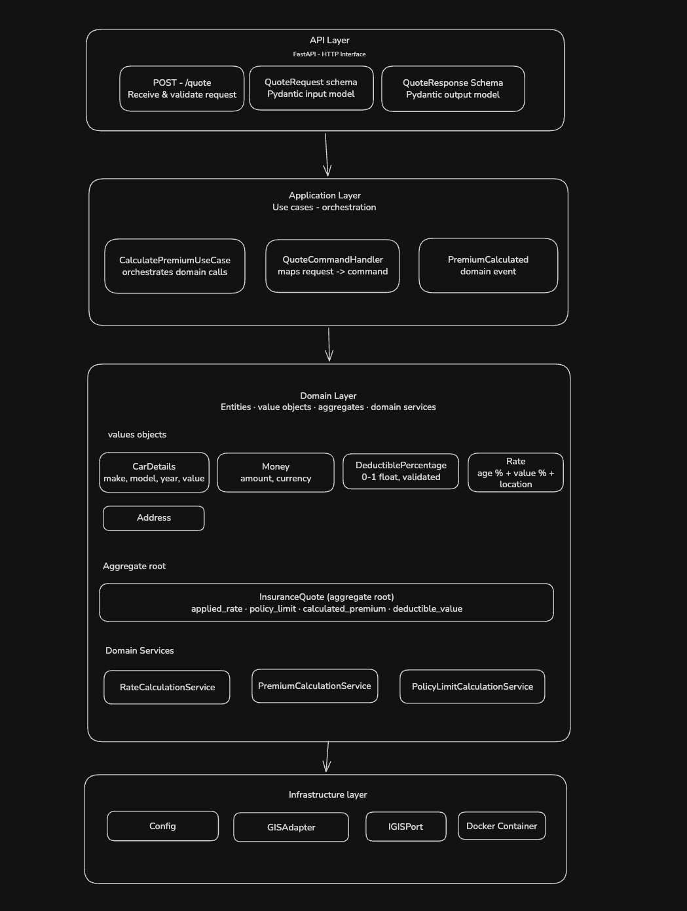

# Car Insurance Premium Simulator

A backend service that calculates car insurance premiums based on car age, value, deductible percentage, and broker's fee. Built with **FastAPI**, containerized with **Docker**, and designed following **Domain-Driven Design (DDD)**, **SOLID**, and **Clean Architecture** principles.

---

## Architecture



The project is organized in four layers with strict dependency rules — outer layers depend on inner ones, never the reverse:

```
API → Application → Domain ← Infrastructure
```

| Layer | Responsibility |
|---|---|
| **API** | HTTP interface, request/response schemas (Pydantic), routing |
| **Application** | Use case orchestration, commands, domain event dispatch |
| **Domain** | Business rules, value objects, entities, domain services, ports |
| **Infrastructure** | Config (pydantic-settings), GIS adapter, external HTTP calls |

---

## Calculation Logic

### 1. Rate

For every year since the car was produced, add `AGE_RATE_PER_YEAR` to the rate.
For every $10,000 of car value, add `VALUE_RATE_PER_10K` to the rate.

```
applied_rate = (current_year - car.year) × AGE_RATE_PER_YEAR
             + (car.value / 10_000)      × VALUE_RATE_PER_10K
```

### 2. Premium

```
base_premium        = car.value × applied_rate
deductible_discount = base_premium × deductible_percentage
calculated_premium  = base_premium − deductible_discount + broker_fee
```

### 3. Policy Limit

```
base_policy_limit = car.value × COVERAGE_PERCENTAGE
deductible_value  = base_policy_limit × deductible_percentage
policy_limit      = base_policy_limit − deductible_value
```

### 4. GIS Adjustment (optional)

If `registration_location` is provided, the rate is adjusted by a geographic risk factor between `−GIS_MAX_ADJUSTMENT` and `+GIS_MAX_ADJUSTMENT`.

By default (no `GIS_SERVICE_URL`), the adjustment is derived deterministically from the address using OpenStreetMap Nominatim geocoding. If the geocoding fails, a SHA-256 hash of the address is used as fallback.

---

## Project Structure

```
car_insurance/
├── src/
│   ├── api/
│   │   ├── main.py                   # FastAPI app factory
│   │   ├── dependencies.py           # Dependency injection
│   │   └── v1/
│   │       ├── router.py             # POST /api/v1/quotes
│   │       └── schemas/
│   │           ├── quote_request.py
│   │           └── quote_response.py
│   ├── application/
│   │   ├── commands/
│   │   │   └── quote_command.py
│   │   └── use_cases/
│   │       └── calculate_premium.py
│   ├── domain/
│   │   ├── entities/
│   │   │   └── insurance_quote.py    # Aggregate root
│   │   ├── events/
│   │   │   └── premium_calculated.py
│   │   ├── ports/
│   │   │   └── gis_port.py           # Abstract interface (ABC)
│   │   ├── services/
│   │   │   ├── policy_limit_calculation.py
│   │   │   ├── premium_calculation.py
│   │   │   └── rate_calculation.py
│   │   └── value_objects/
│   │       ├── address.py
│   │       ├── car_details.py
│   │       ├── deductible_percentage.py
│   │       ├── money.py
│   │       └── rate.py
│   └── infrastructure/
│       ├── adapters/
│       │   └── gis_adapter.py
│       └── config/
│           └── settings.py
├── tests/
│   ├── unit/
│   │   ├── domain/
│   │   ├── application/
│   │   └── infrastructure/
│   └── integration/
│       └── api/
├── img/
│   └── diagram.png
├── .env
├── Dockerfile
├── docker-compose.yml
└── pyproject.toml
```

---

## Getting Started

### Prerequisites

- [Docker](https://docs.docker.com/get-docker/)
- [Docker Compose](https://docs.docker.com/compose/)

### 1. Clone the repository

```bash
git clone <repository-url>
cd car_insurance
```

### 2. Configure environment variables

```bash
cp .env.example .env
```

Edit `.env` to adjust the calculation parameters:

```env
ENV=development

# Rate calculation
AGE_RATE_PER_YEAR=0.05        # 0.5% per year of car age
VALUE_RATE_PER_10K=0.05       # 0.5% per $10,000 of car value

# Policy
COVERAGE_PERCENTAGE=1.0        # 100% coverage

# GIS (leave empty to use OpenStreetMap automatically)
GIS_MAX_ADJUSTMENT=0.02        # ±2% geographic risk adjustment
GIS_SERVICE_URL=
```

### 3. Build and run

```bash
docker compose build
docker compose up
```

The API will be available at `http://localhost:8000`.

Interactive docs (Swagger UI): `http://localhost:8000/docs`

---

## API Reference

### `POST /api/v1/quotes`

Calculates an insurance premium for a given car.

**Request body:**

```json
{
  "broker_fee": 50.0,
  "car": {
    "make": "Mitsubishi",
    "model": "ASX",
    "value": 100000.0,
    "year": 2015
  },
  "deductible_percentage": 0.10,
  "registration_location": {
    "city": "Divinolândia de Minas",
    "country": "Brazil",
    "state": "MG"
  }
}
```

**Response:**

```json
{
  "applied_rate": 0.105,
  "broker_fee": 50.0,
  "calculated_premium": 9500.0,
  "car": {
    "make": "Mitsubishi",
    "model": "ASX",
    "value": 100000.0,
    "year": 2015
  },
  "deductible_percentage": 0.10,
  "deductible_value": 10000.0,
  "policy_limit": 90000.0,
  "registration_location": {
    "city": "Divinolândia de Minas",
    "country": "Brazil",
    "state": "MG"
  }
}
```

### `GET /health`

Returns the service health status.

```json
{ "status": "It's ok and aqui é galo!"}
```

---

## Running Tests

```bash
# Run the full test suite
docker compose run --rm test

# Unit tests only
docker compose run --rm test pytest tests/unit/ -v

# Integration tests only
docker compose run --rm test pytest tests/integration/ -v

# With coverage report
docker compose run --rm test pytest --cov=src --cov-report=term-missing
```

---

## Environment Variables Reference

| Variable | Default | Description |
|---|---|---|
| `ENV` | `development` | Environment name |
| `AGE_RATE_PER_YEAR` | `0.05` | Rate increment per year of car age |
| `VALUE_RATE_PER_10K` | `0.05` | Rate increment per $10k of car value |
| `COVERAGE_PERCENTAGE` | `1.0` | Policy coverage percentage (0–1) |
| `GIS_MAX_ADJUSTMENT` | `0.02` | Maximum GIS rate adjustment (±) |
| `GIS_SERVICE_URL` | `""` | External GIS API URL (optional) |

> All parameters are configurable via `.env` and reflected on the next request without restarting the container.

---

## Design Decisions

**Why DDD?** The domain is rich enough to justify it — the rate, premium, and policy limit calculations are distinct business concerns that benefit from explicit modeling as domain services and value objects.

**Why value objects are frozen dataclasses?** Immutability prevents accidental mutation of domain concepts. A `Rate` of `0.10` should never silently become `0.12` mid-calculation.

**Why `IGISPort` lives in the domain?** The domain defines *what* it needs (a rate adjustment based on location), not *how* it gets it. The infrastructure adapter implements the port, keeping the domain free of HTTP concerns.